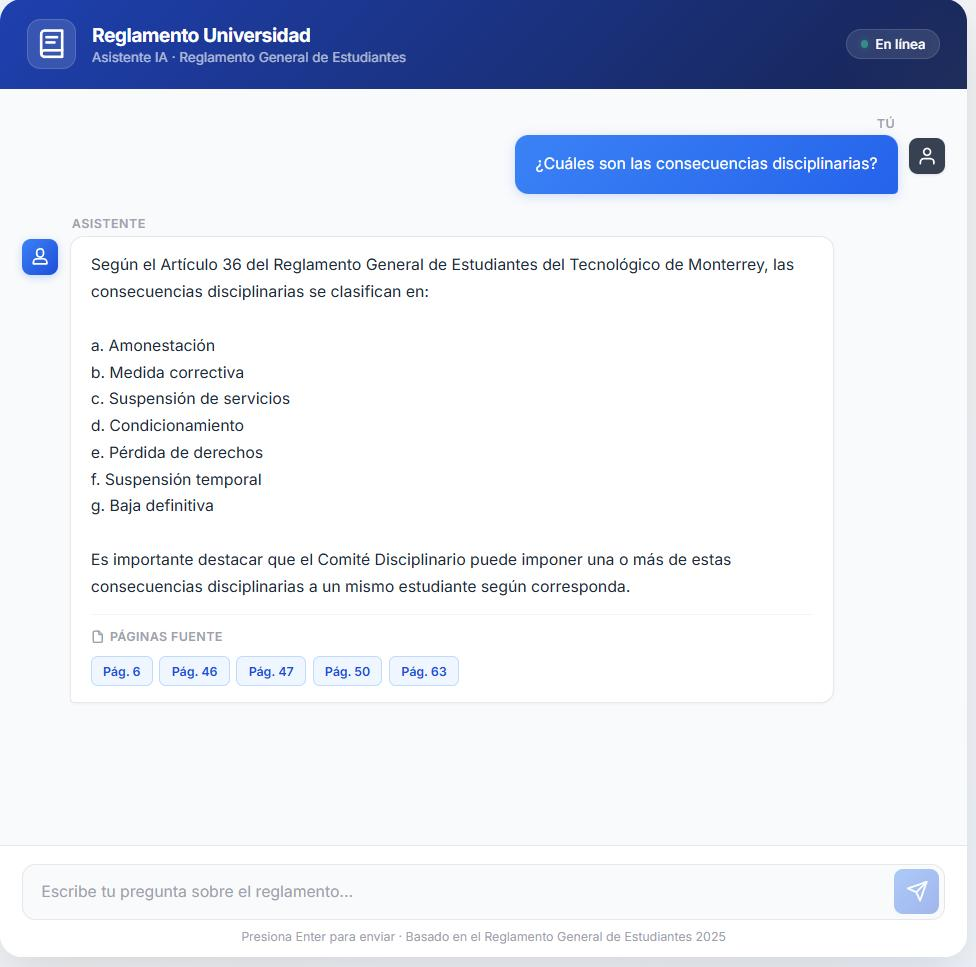

# RAG App — Reglamento Universitario

A full-stack Q&A chat application powered by a Retrieval-Augmented Generation (RAG) pipeline. Ask questions about the **Reglamento General de Estudiantes** and get contextual answers from an LLM.

---

## 🚀 Run with Docker (Recommended)

> **Requirements:** [Docker Desktop](https://www.docker.com/products/docker-desktop/) installed and running. That's it.

### ⚡ Option A — Groq (Recommended: fast, free, no GPU needed)

```bash
# 1. Clone the repository
git clone https://github.com/DylanEstrada9838/full-stack-rag-app.git
cd full-stack-rag-app

# 2. Create your environment file
cp .env.example .env     # Linux/macOS
copy .env.example .env   # Windows

# 3. Open .env and add your Groq API key:
#    Get a free key at https://console.groq.com
#    LLM_PROVIDER=groq
#    GROQ_API_KEY=your_key_here

# 4. Build the vector database from the PDF (first time only)
docker compose run --rm backend python rebuild_db.py

# 5. Start the full stack
docker compose up --build
```

### 🖥️ Option B — Ollama (local model, no API key, requires ~4 GB download)

```bash
# Same steps 1-4 as above, but set in .env:
#   LLM_PROVIDER=ollama

# 5. Start with the ollama profile
docker compose --profile ollama up --build
```

> **First run note (Ollama only):** Docker will download the `llama3` model (~4GB). This only happens once — subsequent starts are fast because the model is cached in a Docker volume.

| Service | URL |
|---------|-----|
| 🌐 Frontend (React UI) | http://localhost:3000 |
| ⚙️ Backend API | http://localhost:8000 |

To stop everything:
```bash
docker compose down
```

---

## 🧠 The RAG Pipeline Process

This application uses a sophisticated **Retrieval-Augmented Generation (RAG)** pipeline to ensure answers are based on official documentation.

### What is RAG?
Instead of the AI guessing or hallucinating an answer, RAG allows it to **retrieve** trusted text from a specific document (the PDF) and then **generate** a response based *only* on that verified content.

### Step-by-Step Architecture:

1.  **Preparation (Indexing)**:
    *   The `reglamento-general-estudiantes-esp.pdf` is split into **Chunks** (small, readable snippets).
    *   **Embeddings**: Each chunk is analyzed and converted into a numeric representation of its meaning using `all-MiniLM-L6-v2`.
    *   **Vector Database**: These meanings are stored in **Chroma DB** for lightning-fast semantic search.

2.  **Hybrid Retrieval (The Search)**:
    When you send a question, the backend performs two types of searches at once:
    *   **Semantic Search (MMR)**: Finds content with the same *idea* or *meaning*.
    *   **Keyword Search (BM25)**: Finds content with specific *exact words*.
    *   These results are mixed (60% semantic, 40% keywords) to guarantee the best match.

3.  **Reranking (The Filter)**:
    The top candidates are passed through a secondary model (`bge-reranker-v2-m3`) that performs a deep analysis to sort them by absolute relevance. Only the **top 5 most accurate snippets** are kept.

4.  **Final Generation**:
    *   The relevant snippets are added to the AI's prompt as **Context**.
    *   The LLM reads the snippets and answers your question using *only* that information.
    *   Supports two backends: **Groq** (cloud, fast, free API key) or **Ollama** (local Llama 3, no key needed).


```
rag-app/
├── assets/          # Project screenshots and media
├── backend/         # FastAPI + RAG pipeline
│   ├── rag_pipeline/ # Chunking, vectorstore, retriever, LLM chain
│   ├── .env.example  # Template for environment variables
│   ├── Dockerfile    # Backend container image
│   ├── main.py      # API server
│   ├── rebuild_db.py # Script to initialize/build the vector DB
│   └── requirements.txt
├── frontend/        # React chat UI
│   ├── src/
│   ├── Dockerfile    # Frontend container image (Nginx)
│   ├── nginx.conf    # Nginx reverse-proxy config
│   ├── .env.example  # Template for frontend API URL
│   └── package.json
├── .env.example     # Root env file for Docker Compose secrets
├── docker-compose.yml
├── .gitignore
└── README.md
```

---

## Prerequisites (Manual Setup)

- **Python 3.10+**
- **Node.js 18+**
- **LLM** — choose one:
  - **Groq** (recommended): Free API key from [console.groq.com](https://console.groq.com)
  - **Ollama** (local): Install [Ollama](https://ollama.com) and run `ollama pull llama3`

---

## Quick Start (Manual / Development)

### 1. Backend

```bash
# Navigate to backend
cd rag-app/backend

# Create and activate virtual environment
python -m venv venv
venv\Scripts\activate        # Windows
# source venv/bin/activate   # macOS/Linux

# Create environment file and add your LLM credentials
cp .env.example .env    # then edit .env with your GROQ_API_KEY (or HF_TOKEN)

# Install dependencies
pip install -r requirements.txt

# --- IMPORTANT: Initialize/Build the vector database ---
# The database is not included in git. Build it from the PDF:
python rebuild_db.py

# Start the API server
uvicorn main:app --reload
```

The API will be available at **http://localhost:8000**.  
Test it: open **http://localhost:8000/health** in your browser.

### 2. Frontend

Open a **new terminal**:

```bash
# Navigate to frontend
cd rag-app/frontend

# Install dependencies
npm install

# Start the dev server
npm run dev
```

The app will be available at **http://localhost:5173**.


---

## 🛠️ Tech Stack


### Frontend
- **React (Vite)**: Modern, high-performance UI library and build tool.
- **Vanilla CSS**: Custom-built styles for a premium blue-themed aesthetic.

### Backend
- **FastAPI**: A modern, high-speed Python web framework for building APIs.
- **Uvicorn**: High-performance ASGI server for running the FastAPI application.
- **Modular Design**: Clean separation between server logic, state management, and the RAG pipeline.

### RAG Pipeline (The Core)
- **LangChain / LangChain-Classic**: The main orchestration framework for building the RAG chain and managing retrievers.
- **ChromaDB**: A powerful vector database used for local semantic storage and retrieval.
- **Sentence Transformers**: `all-MiniLM-L6-v2` for generating precise semantic embeddings.
- **BGE Reranker**: `bge-reranker-v2-m3` via HuggingFace for intelligent Cross-Encoder result sorting.
- **Groq**: Cloud LLM API — fast inference with `llama-3.3-70b-versatile` (default, free tier available).
- **Ollama**: Alternative local engine to host and run **Llama 3**, ensuring privacy with no API key.
- **Rank-BM25**: Industry-standard algorithm for sparse (keyword-based) search.
- **PyMuPDF**: Efficient extraction and processing of content from the regulation PDF.

---

## 🔍 Optimization & Evaluation

The performance of this RAG system is not accidental. The current configuration was selected through a rigorous experimental process:

1.  **Ground Truth Generation**: A custom dataset of Q&A pairs was created from the regulation PDF, mapping specific questions to their exact source pages.
2.  **Chunking Experiments**: **20 different versions** of the Chroma vector database were generated using various chunking strategies (varying sizes, overlaps, and methods like recursive vs. semantic).
3.  **Random Search Tuning**: We conducted a **Random Search** across **20 different retrieval configurations**, testing various combinations of:
    *   `k` (number of documents retrieved)
    *   `lambda_mult` (MMR diversity)
    *   Hybrid search weights (Dense vs. Sparse)
4.  **Metrics**: Each configuration was evaluated against the Ground Truth using industry-standard metrics:
    *   **Hit Rate**: Measuring how often the correct document was in the top results.
    *   **MRR (Mean Reciprocal Rank)**: Measuring how high up the correct document appeared in the list.

The current settings represent the **highest-performing configuration** discovered during this optimization phase, ensuring top-tier retrieval accuracy and speed.

---

### 📸 Application UI


---

## API Endpoints

| Method | Endpoint  | Description |
|--------|-----------|-------------|
| GET    | `/health` | Health check |
| POST   | `/ask`    | Send a question, get an answer + source pages |

### Example request:

```bash
curl -X POST http://localhost:8000/ask \
  -H "Content-Type: application/json" \
  -d '{"question": "¿Qué implica la baja definitiva?"}'
```

### Example response:

```json
{
  "answer": "La baja definitiva implica la exclusión permanente del estudiante...",
  "sources": [47, 51]
}
```

---

