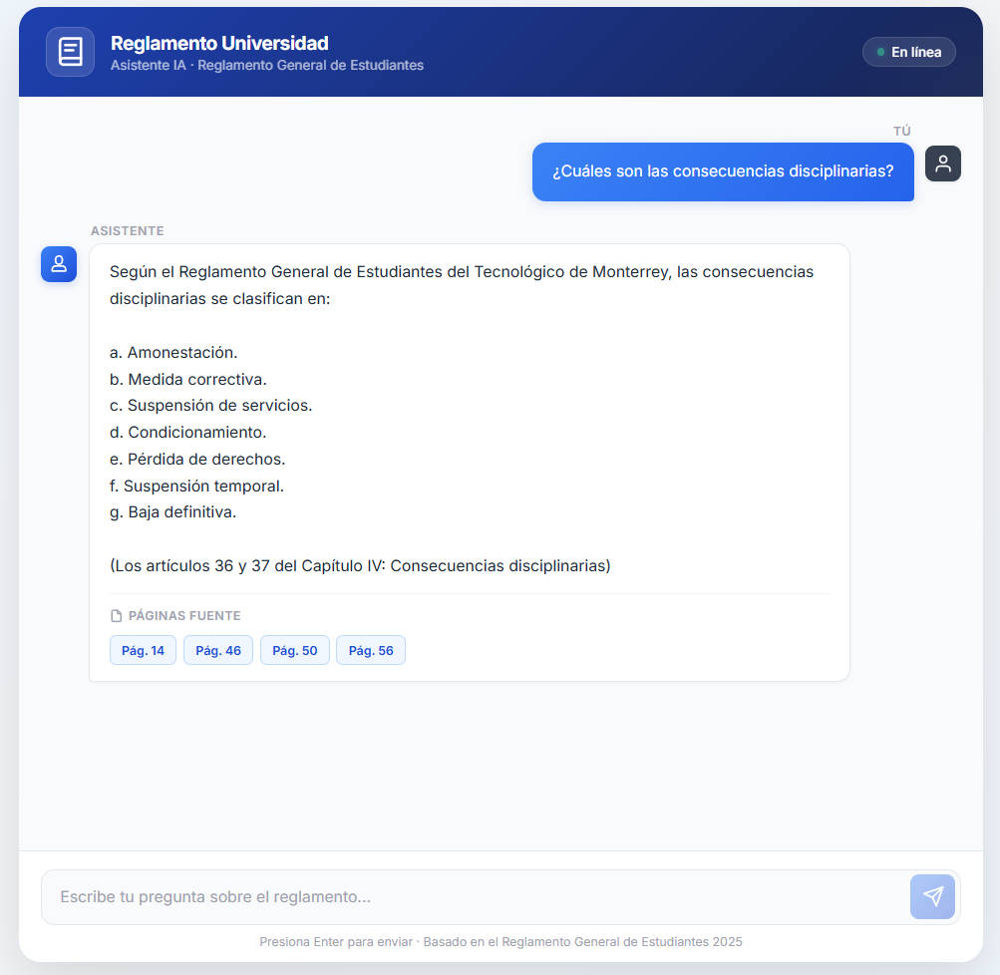

# RAG App — Reglamento Tec de Monterrey

A full-stack Q&A chat application powered by a Retrieval-Augmented Generation (RAG) pipeline. Ask questions about the **Reglamento General de Estudiantes** and get contextual answers from an LLM.

## 🧠 The RAG Pipeline Process

This application uses a sophisticated **Retrieval-Augmented Generation (RAG)** pipeline to ensure answers are based on official documentation.

### What is RAG?
Instead of the AI guessing or hallucinating an answer, RAG allows it to **retrieve** trusted text from a specific document (the PDF) and then **generate** a response based *only* on that verified content.

### Step-by-Step Architecture:

1.  **Preparation (Indexing)**:
    *   The `reglamento-general-estudiantes-esp.pdf` is split into **Chunks** (small, readable snippets).
    *   **Embeddings**: Each chunk is analyzed and converted into a numeric representation of its meaning using `all-MiniLM-L6-v2`.
    *   **Vector Database**: These meanings are stored in **Chroma DB** for lightning-fast semantic search.

2.  **Hybrid Retrieval (The Search)**:
    When you send a question, the backend performs two types of searches at once:
    *   **Semantic Search (MMR)**: Finds content with the same *idea* or *meaning*.
    *   **Keyword Search (BM25)**: Finds content with specific *exact words*.
    *   These results are mixed (60% semantic, 40% keywords) to guarantee the best match.

3.  **Reranking (The Filter)**:
    The top candidates are passed through a secondary model (`bge-reranker-v2-m3`) that performs a deep analysis to sort them by absolute relevance. Only the **top 5 most accurate snippets** are kept.

4.  **Final Generation**:
    *   The relevant snippets are added to the AI's prompt as **Context**.
    *   **Ollama (Llama 3)** reads the snippets and answers your question using *only* that information.


```
rag-app/
├── assets/          # Project screenshots and media
├── backend/         # FastAPI + RAG pipeline
│   ├── rag_pipeline/ # Chunking, vectorstore, retriever, LLM chain
│   ├── .env.example  # Template for environment variables
│   ├── main.py      # API server
│   ├── rebuild_db.py # Script to initialize/build the vector DB
│   └── requirements.txt
├── frontend/        # React chat UI
│   ├── src/
│   ├── .env.example  # Template for frontend API URL
│   └── package.json
├── .gitignore       # Git exclusion rules
└── README.md        # This file
```

---

## Prerequisites

- **Python 3.10+**
- **Node.js 18+**
- **Ollama** installed and running with `llama3` model:
  ```bash
  ollama run llama3
  ```

---

## Quick Start

### 1. Backend

```bash
# Navigate to backend
cd rag-app/backend

# Create and activate virtual environment
python -m venv venv
venv\Scripts\activate        # Windows
# source venv/bin/activate   # macOS/Linux

# Create environment file
cp .env.example .env
# (Optional) Open .env and add your HF_TOKEN if needed

# Install dependencies
pip install -r requirements.txt

# --- IMPORTANT: Initialize/Build the vector database ---
# The database is not included in git. Build it from the PDF:
python rebuild_db.py

# Start the API server
uvicorn main:app --reload
```

The API will be available at **http://localhost:8000**.  
Test it: open **http://localhost:8000/health** in your browser.

### 2. Frontend

Open a **new terminal**:

```bash
# Navigate to frontend
cd rag-app/frontend

# Install dependencies
npm install

# Start the dev server
npm run dev
```

The app will be available at **http://localhost:5173**.

---

## 🛠️ Tech Stack

### Frontend
- **React (Vite)**: Modern, high-performance UI library and build tool.
- **Vanilla CSS**: Custom-built styles for a premium blue-themed aesthetic.

### Backend
- **FastAPI**: A modern, high-speed Python web framework for building APIs.
- **Uvicorn**: High-performance ASGI server for running the FastAPI application.
- **Modular Design**: Clean separation between server logic, state management, and the RAG pipeline.

### RAG Pipeline (The Core)
- **LangChain / LangChain-Classic**: The main orchestration framework for building the RAG chain and managing retrievers.
- **ChromaDB**: A powerful vector database used for local semantic storage and retrieval.
- **Sentence Transformers**: `all-MiniLM-L6-v2` for generating precise semantic embeddings.
- **BGE Reranker**: `bge-reranker-v2-m3` via HuggingFace for intelligent Cross-Encoder result sorting.
- **Ollama**: Local engine to host and run the **Llama 3** LLM, ensuring privacy and speed.
- **Rank-BM25**: Industry-standard algorithm for sparse (keyword-based) search.
- **PyMuPDF**: Efficient extraction and processing of content from the regulation PDF.

---

### 📸 Application Interface


---

## API Endpoints

| Method | Endpoint  | Description |
|--------|-----------|-------------|
| GET    | `/health` | Health check |
| POST   | `/ask`    | Send a question, get an answer + source pages |

### Example request:

```bash
curl -X POST http://localhost:8000/ask \
  -H "Content-Type: application/json" \
  -d '{"question": "¿Qué implica la baja definitiva?"}'
```

### Example response:

```json
{
  "answer": "La baja definitiva implica la exclusión permanente del estudiante...",
  "sources": [47, 51]
}
```

---

